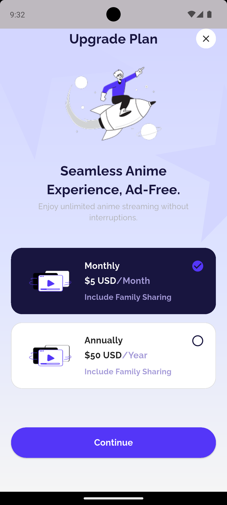

# 🎌 Anime App Demo

A modern Flutter application for anime enthusiasts, built with clean architecture principles and state management using BLoC/Cubit pattern.

## 📱 App Preview

<div align="center">

| Home Screen | Anime Details | Subscription Plans |
|------------|---------------|-------------------|
|  |  |  |

</div>

## ✨ Features

### 🏠 **Home Screen**
- **Popular Anime Collection**: Curated list of trending anime series
- **Top Characters**: Showcase of beloved anime characters
- **Smooth Navigation**: Intuitive user interface with fluid animations
- **Search & Discovery**: Easy browsing through anime collections

### 📺 **Anime Details**
- **Rich Media Display**: High-quality poster images and logos
- **Comprehensive Info**: Genre tags, ratings, view count, and seasons
- **Detailed Descriptions**: In-depth anime summaries with flame indicators
- **Interactive Actions**: Preview and Watch Now buttons
- **Statistics Display**: View counts, clap ratings, and season information

### 💎 **Premium Plans**
- **Subscription Options**: Monthly and Annual premium plans
- **Ad-Free Experience**: Seamless anime streaming without interruptions
- **Family Sharing**: Include family members in premium benefits
- **Modern UI**: Beautiful gradient backgrounds with animated selections

## 🏗️ Architecture

Built following **Clean Architecture** principles:

# 📂 Project Structure

```bash
anime_app_demo/
├── android/                # 🤖 Native Android code
├── ios/                    # 🍏 Native iOS code
├── lib/                    # 📦 Main Flutter source code
│   ├── core/               # ⚙️ Core utilities, DI, routing, errors
│   │   ├── di/             # Dependency Injection setup
│   │   ├── error/          # Error handling
│   │   ├── router/         # Navigation & routes
│   │   ├── utils/          # Utility functions/constants
│   │   └── widgets/        # Reusable widgets
│   ├── features/           # 🎯 Feature-based modules
│   │   ├── home/           # Home screen feature
│   │   ├── details/        # Details screen feature
│   │   └── plan/           # Subscription plan feature
│   └── main.dart           # 🚀 Entry point of the app
├── assets/                 # 🎨 Images, SVGs, and other assets
│   ├── details/
│   ├── objects/
│   └── screenshots/
├── pubspec.yaml            # 📌 Dependencies & assets configuration
└── README.md               # 📖 Project documentation

```
## 🛠️ Tech Stack

### **Frontend**
- **Flutter** - Cross-platform mobile framework
- **Dart** - Programming language

### **State Management**
- **flutter_bloc** - Predictable state management library
- **Cubit** - Simplified BLoC implementation

### **Architecture & Patterns**
- **Clean Architecture** - Separation of concerns
- **Repository Pattern** - Data abstraction layer
- **Dependency Injection** - GetIt service locator

### **Navigation & Routing**
- **GoRouter** - Declarative routing solution
- **Deep Linking** - URL-based navigation support

### **Functional Programming**
- **Dartz** - Functional programming with Either types
- **Error Handling** - Robust failure management

### **UI & Design**
- **Flutter SVG** - Scalable vector graphics support
- **Custom Animations** - Smooth transitions and interactions
- **Responsive Design** - Adaptive layouts for different screens

## 📦 Dependencies

```yaml
dependencies:
  flutter:
    sdk: flutter
  
  # State Management
  flutter_bloc: ^8.1.3
  equatable: ^2.0.5
  
  # Functional Programming
  dartz: ^0.10.1
  
  # Dependency Injection
  get_it: ^7.6.4
  
  # Navigation
  go_router: ^13.2.0
  
  # UI Components
  flutter_svg: ^2.0.9
  
  # Development
  flutter_lints: ^3.0.0
